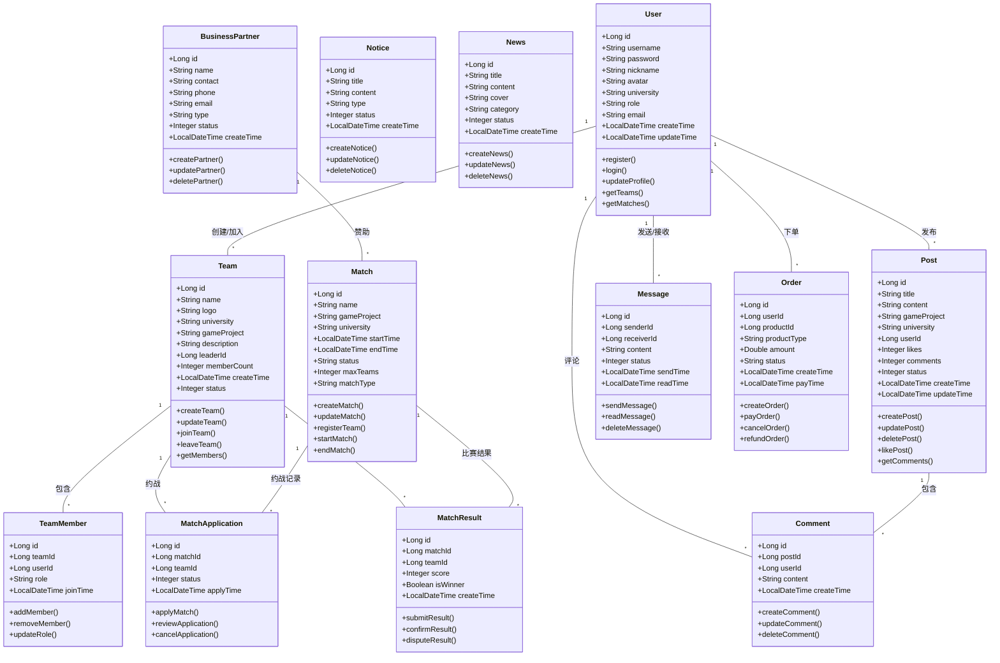

# 高校电竞约赛平台UML类图

## 类图说明

### 核心实体类

1. **User** - 用户实体
   - 核心身份认证和用户信息管理
   - 支持多角色权限控制
2. **Team** - 战队实体
   - 战队基本信息和成员管理
   - 支持战队创建、更新、解散
3. **Match** - 赛事实体
   - 赛事基本信息和报名管理
   - 支持赛事状态流转
4. **Post** - 社区帖子实体
   - 电竞交流社区内容管理
   - 支持点赞、评论互动

### 关系说明

- **用户与战队**：一对多关系，一个用户可加入多个战队
- **战队与赛事**：多对多关系，通过MatchApplication中间表
- **帖子与评论**：一对多关系，一个帖子可包含多个评论
- **用户与内容**：一对多关系，用户可发布多个帖子和评论

### 业务流程

1. **战队创建流程**：用户创建战队 → 战队信息保存 → 自动成为队长
2. **赛事报名流程**：战队报名赛事 → 赛事组织者审核 → 审核通过后参赛
3. **社区交流流程**：用户发布帖子 → 其他用户评论/点赞 → 帖子热度统计
4. **比赛结果流程**：比赛结束 → 提交结果 → 双方确认 → 系统判定

这个类图完整覆盖了高校电竞约赛平台的核心业务实体和关系，为系统开发提供了清晰的架构指导。
