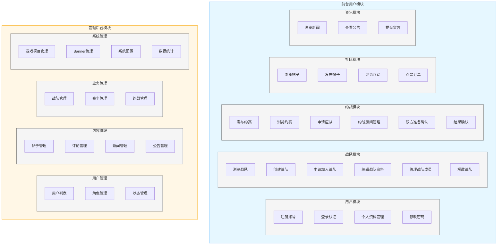
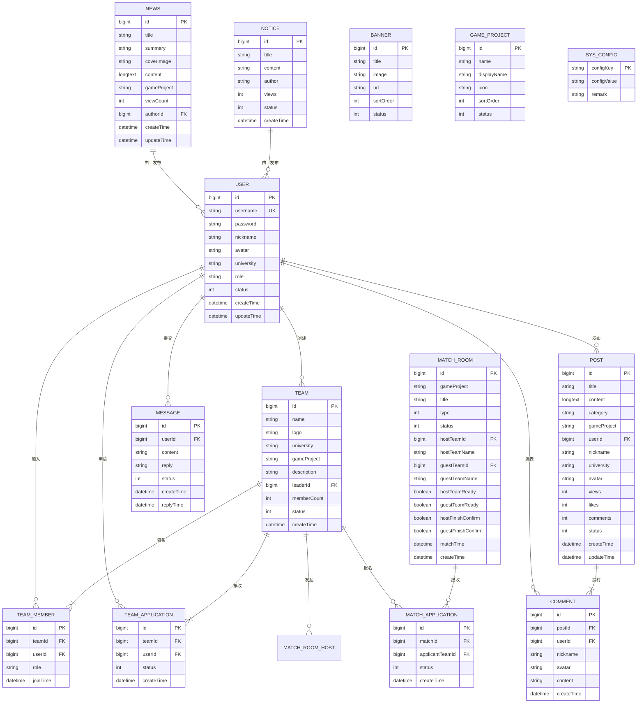
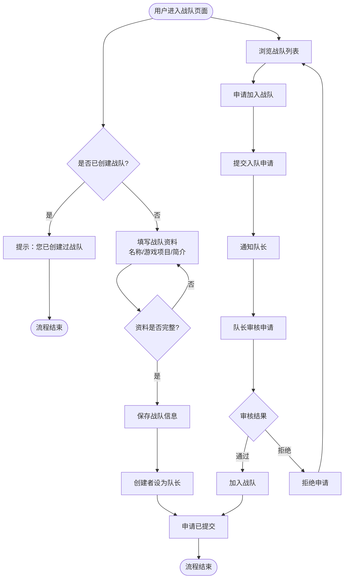
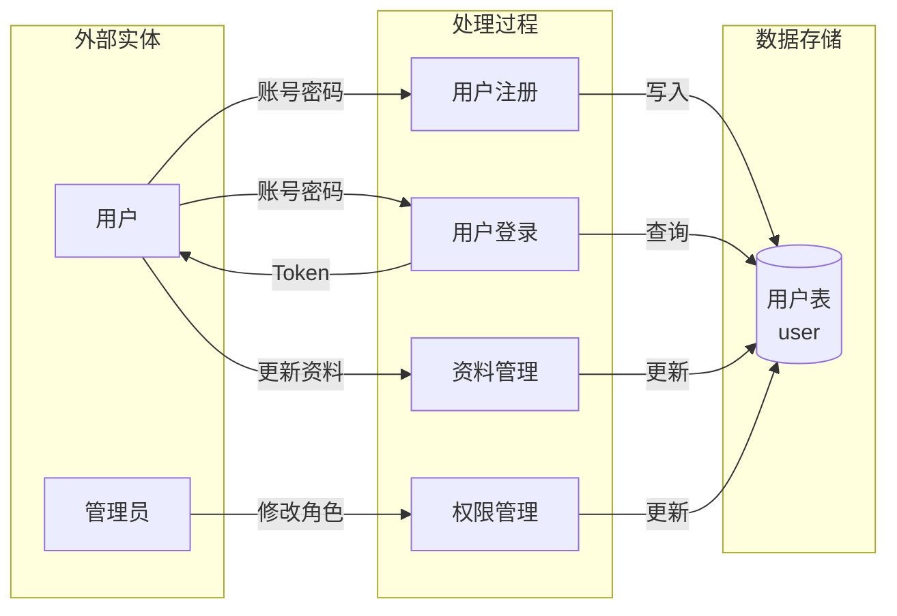
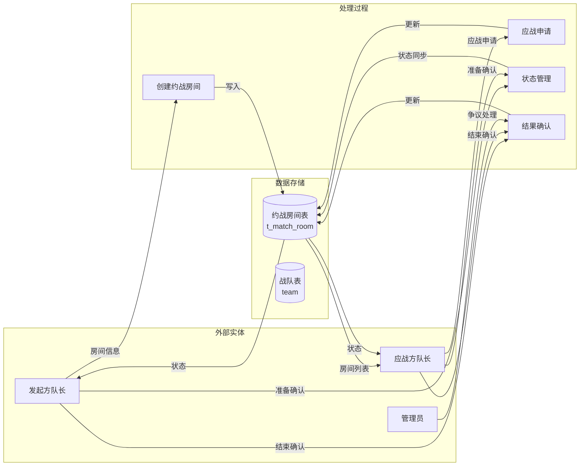
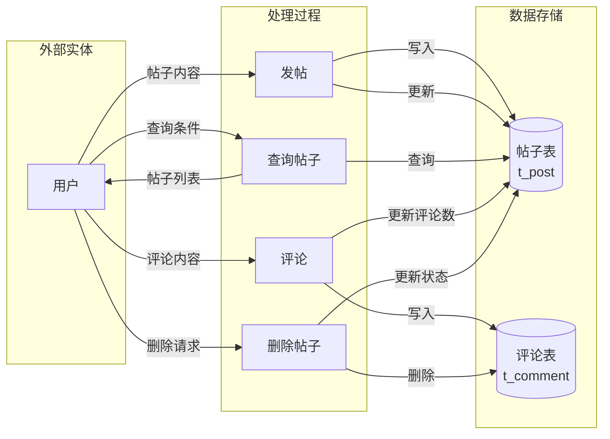

# 高校电竞约赛平台——系统设计报告

**项目名称**：高校电竞约赛平台（蘸豆爽）\
**报告类型**：系统设计报告\
**版本**：V3.0\
**撰写日期**：2026年5月\
**撰写人**：邓川

***

## 目录

1. [项目概述](#1-项目概述)
2. [系统需求概述](#2-系统需求概述)
3. [功能模块图](#3-功能模块图)
4. [实体关系图（ER）](#4-实体关系图er)
5. [业务流程图（BP）](#5-业务流程图bp)
6. [数据流图（DFD）](#6-数据流图dfd)
7. [系统开发技术规格说明](#7-系统开发技术规格说明)

***

## 1. 项目概述

### 1.1 项目背景

随着电子竞技产业的蓬勃发展，高校电竞文化氛围日益浓厚，各类校园电竞活动层出不穷。然而，目前国内缺乏专门针对高校学生的专业电竞服务平台，现有通用电竞平台普遍存在定位偏职业化、功能过于繁琐、缺乏校园本土化设计等问题，难以满足高校学生对轻量化、社交化、本地化电竞服务的需求。

高校学生作为电竞爱好者的核心群体，具有身份统一（校园邮箱验证）、社交需求强烈、活动组织集中（校内/校际赛事）等鲜明特点。构建一个面向高校学生的垂直电竞服务平台，不仅能够有效整合校园电竞资源，提升赛事组织效率，还能通过校园身份认证构建纯粹的校园电竞社区生态，推动高校电竞文化的健康发展。

本项目"蘸豆爽"正是基于这一背景而立项，旨在为广大高校学生打造一个专属的电竞社交与赛事服务一站式平台。

### 1.2 项目目标

本项目的核心目标是将高校电竞约赛平台建设成为一个功能完善、体验优良、安全可靠的高校电竞垂直圈层服务平台，具体包括以下五个维度：

**（1）约战有渠道**：提供战队间约战匹配功能，支持按游戏项目、学校等维度筛选，降低战队间约战的沟通成本，让约战更加便捷高效。

**（2）赛事有组织**：支持赛事发布、报名审核、状态跟踪全流程管理，赛事组织者可以便捷地创建和管理赛事，战队可以方便地查找和报名感兴趣的比赛。

**（3）交流有阵地**：建设社区论坛支持帖子发布、评论互动、点赞分享等功能，为高校电竞爱好者提供一个自由交流、分享经验的专属社区空间。

**（4）展示有平台**：提供战队风采展示、选手信息展示、电竞新闻资讯等功能，让优秀战队和选手有展示自我的舞台，让用户能够及时获取电竞资讯。

**（5）管理有抓手**：提供完善的管理后台，支持用户管理、内容审核、游戏项目管理、Banner配置、系统参数管理等，确保平台健康运营。

***

## 2. 系统需求概述

### 2.1 功能需求

根据对项目目标的分解，系统功能需求可划分为以下八大核心模块：

**（1）用户与认证模块**：包括用户注册（用户名+密码）、登录（JWT Token认证）、个人资料管理（头像上传、昵称、学校等修改）、修改密码（需验证原密码）。密码采用MD5加密存储，保障用户数据安全。

**（2）战队管理模块**：包括创建战队（创建后自动成为队长）、申请加入战队（需队长审核）、战队资料编辑（名称、口号、Logo等）、成员管理（添加/移除成员、角色分配）、队长解散战队等功能。

**（3）约战模块**：包括发布约赛信息（设定游戏项目、学校、时间等）、申请对接约赛、其他战队应战、约战房间管理（双方准备确认、比赛开始/结束确认）等全生命周期管理。

**（4）社区交流模块**：包括帖子发布与编辑（支持富文本，关联游戏板块）、帖子列表查询（支持分类/项目/关键词/排序筛选）、评论发布与删除、帖子点赞、浏览量统计等功能。

**（5）电竞资讯模块**：包括电竞新闻的发布、编辑、删除和列表展示，支持按游戏项目分类，提供新闻详情页浏览。

**（6）公告与留言模块**：包括系统公告的发布与展示（管理员发布，用户前台查看）、用户留言反馈（提交留言，管理员回复）的完整闭环。

**（7）平台配置模块**：包括Banner轮播图管理（多图上传、排序、链接配置）、游戏项目配置（支持LOL、王者荣耀、CS2等多款游戏）、系统参数配置等。

**（8）管理后台模块**：包括用户管理（列表查看、角色修改、状态管理、删除）、战队管理（列表、编辑、解散）、赛事管理、社区内容管理（帖子/评论审核）、数据统计仪表盘等。

### 2.2 参与者

系统的使用者（Actor）可归纳为以下五类角色，每类角色在系统中承担不同的职能：

**（1）普通用户**：已完成基础注册的高校学生，是平台的主要用户群体。可浏览赛事信息、社区内容、新闻公告，创建或申请加入战队，发布帖子和评论，提交留言反馈等。

**（2）战队队长**：创建战队或被任命为队长的用户，在普通用户基础上拥有额外的战队管理权限。可审核入队申请、编辑战队资料、移除成员、解散战队，发起约战房间并确认约战结果。

**（3）赛事组织者**：发布和管理赛事的用户，可创建约赛信息、审核报名申请、管理赛事进度。在实际业务中，战队队长常常同时承担赛事组织者角色。

**（4）管理员**：平台运营人员，拥有最高权限。可进行用户管理、内容审核、系统配置、Banner管理、游戏项目管理、数据统计分析等全面的平台管理操作。

**（5）校园商户（潜在）**：平台合作商家，可发布优惠活动、赞助赛事、预约场地等。该角色为平台未来商业化预留角色，当前版本中暂未完全实现。

### 2.3 非功能需求

除上述功能需求外，系统在性能、安全、可用性、扩展性等方面也需要满足以下非功能需求：

**（1）性能需求**：系统应能支持至少100个并发用户同时在线操作；页面响应时间不超过3秒；数据库查询在合理索引下不超过500毫秒；文件上传功能稳定可靠，单个文件大小限制为10MB。

**（2）安全性需求**：用户密码必须加密存储（采用MD5）；敏感操作需进行JWT Token身份认证；跨域请求需进行来源校验；文件上传需进行类型和大小校验，防止恶意文件上传。

**（3）可用性需求**：系统应保证7×24小时可访问；关键业务操作（注册、登录、发帖）需提供清晰的操作反馈；错误场景需给出友好提示，避免用户困惑。

**（4）可扩展性需求**：系统采用分层架构设计，各层之间通过接口交互，便于后续功能扩展；游戏项目配置化，支持新增游戏项目而无需修改代码；前端采用动态路由，支持游戏板块的自动扩展。

**（5）数据完整性需求**：约战双方结果确认机制确保比赛结果的公平性；战队成员关系通过申请-审核机制确保数据准确性；帖子/评论删除时需处理好关联数据。

***

## 3. 功能模块图

### 3.1 系统功能模块划分

本系统围绕高校电竞约赛的核心场景，将功能划分为前台用户模块和管理后台模块两大部分，每个大部分下又细分为多个功能子模块，形成层次分明的功能架构。



**功能模块图说明**：

上图将系统功能清晰地划分为前台用户模块和管理后台模块两大区域，每个区域内部又按业务域进一步划分为若干子模块。这种层次化的模块划分方式，便于开发团队理解系统全貌，也有助于后续的功能迭代和维护。前台模块面向普通用户，强调浏览和交互；后台模块面向管理员，强调管理和配置。

### 3.2 模块间关系说明

各功能模块之间存在以下依赖和协作关系：

**用户模块**是基础模块，所有其他功能模块都依赖于用户身份认证；用户创建战队后自动获得队长身份，进而获得战队管理权限。**战队模块**是约战模块的前置条件，只有创建或加入了战队，才能发起或参与约战。**社区模块**和**资讯模块**相对独立，与其他模块耦合度较低，主要提供信息浏览和社交互动功能。**管理后台模块**对前台所有业务数据进行管理和监督，是平台规范化运营的保障。

***

## 4. 实体关系图（ER）

### 4.1 核心实体与关系总览

系统的核心实体包括用户（User）、战队（Team）、战队成员（TeamMember）、入队申请（TeamApplication）、约战房间（MatchRoom）、约赛信息（MatchInfo）、约赛申请（MatchApplication）、帖子（Post）、评论（Comment）、新闻（News）、公告（Notice）、留言（Message）、Banner、游戏项目（GameProject）、系统配置（SysConfig）等。以下通过ER图展示各实体之间的关联关系：



### 4.2 ER图关键关系解读

**（1）用户-战队关系（聚合关系）**：一个用户可以创建多个战队，也可以申请加入多个战队。用户与战队成员之间通过TeamMember表建立多对多关系，通过TeamApplication表记录入队申请流程。战队成员关系中的role字段区分队长（leader）和普通成员（member）。

**（2）约战房间关系**：MatchRoom实体记录约战的完整信息，包含发起战队（hostTeamId）和应战战队（guestTeamId）两个外键，以及双方准备状态（hostTeamReady/guestTeamReady）和结束确认状态（hostFinishConfirm/guestFinishConfirm）四个布尔字段，确保约战过程的公平透明。

**（3）帖子-评论关系（组合关系）**：一个帖子可以有多条评论，Comment表通过postId外键关联到Post。帖子记录评论数（comments字段），在删除帖子时需同步删除关联评论以保证数据一致性。

**（4）配置类实体**：Banner、GameProject、SysConfig等实体用于存储系统的可配置数据，与业务数据相对独立。Banner表存储首页轮播图信息；GameProject表存储游戏项目配置，支持动态增减游戏项目；SysConfig表以Key-Value形式存储系统参数。

***

## 5. 业务流程图（BP）

### 5.1 核心业务流程概览

系统的核心业务流程围绕用户的主要操作路径展开，包括用户注册认证流程、战队创建与加入流程、约战完整流程、社区发帖与互动流程等。以下通过活动图对各核心业务流程进行详细说明。

> 【此处插入图片：D:\Zother\Java\code\esports-zhandoushaung\资料\绘图\核心业务流程图.png】

### 5.2 用户注册与登录流程

```mermaid
flowchart TD
    start([用户访问注册页面])
    input_info[填写账号、密码、昵称、学校信息]
    check_empty{信息是否完整}
    check_username{用户名是否已存在}
    save_user[保存用户信息]
    encrypt_pass[密码MD5加密存储]
    reg_success[注册成功]
    show_error[提示错误信息]
    go_login[跳转登录页面]
    input_login[输入用户名密码]
    encrypt_login[密码MD5加密]
    verify_user[查询验证用户]
    check_pass{密码是否正确}
    gen_token[生成JWT Token]
    login_success[登录成功，保存Token]
    login_fail[登录失败]
    
    start --> input_info
    input_info --> check_empty
    check_empty -->|否| show_error
    show_error --> input_info
    check_empty -->|是| check_username
    check_username -->|已存在| show_error
    check_username -->|可注册| save_user
    save_user --> encrypt_pass
    encrypt_pass --> reg_success
    reg_success --> go_login
    go_login --> input_login
    input_login --> encrypt_login
    encrypt_login --> verify_user
    verify_user --> check_pass
    check_pass -->|是| gen_token
    check_pass -->|否| login_fail
    gen_token --> login_success
    login_fail --> input_login
    
    login_success --> end([进入首页])
```

**说明**：用户注册时需填写完整信息，系统验证用户名唯一性后以MD5加密形式存储密码；登录时将输入密码同样加密后与数据库比对验证，验证成功后生成JWT Token返回前端。

### 5.3 战队创建与加入流程



**说明**：用户加入战队需要经过"申请→队长审核"的流程，确保战队管理的规范性。用户一旦创建战队则成为队长，拥有审核其他用户入队申请的权限。

### 5.4 约战完整流程

```mermaid
flowchart TD
    start([队长发起约战])
    create_room[填写约战信息<br/>游戏/时间/要求]
    publish_room[发布到约战大厅]
    browse_room[其他队长浏览大厅]
    apply_battle[申请应战]
    host_confirm[发起方确认应战]
    room_waiting[房间进入等待状态]
    ready_check{双方是否准备?}
    ready_host[发起方队长准备]
    ready_guest[应战方队长准备]
    all_ready[双方准备就绪]
    countdown[倒计时开始]
    battle_start[比赛正式开始]
    battle_end[比赛结束]
    confirm_both[双方确认结果]
    result_record[保存战绩记录]
    room_close[房间关闭归档]
    cancel_room[任一方取消约战]
    dispute[产生争议]
    admin_handle[管理员介入处理]
    
    start --> create_room
    create_room --> publish_room
    publish_room --> browse_room
    browse_room --> apply_battle
    apply_battle --> host_confirm
    host_confirm --> room_waiting
    room_waiting --> ready_check
    ready_check -->|准备| ready_host
    ready_check -->|准备| ready_guest
    ready_host --> all_ready
    ready_guest --> all_ready
    all_ready --> countdown
    countdown --> battle_start
    battle_start --> battle_end
    battle_end --> confirm_both
    confirm_both --> result_record
    result_record --> room_close
    room_waiting -->|取消| cancel_room
    cancel_room --> room_close
    confirm_both -->|有异议| dispute
    dispute --> admin_handle
    admin_handle --> result_record
    
    room_close --> end([流程结束])
```

**说明**：约战是平台的核心业务流程，采用"双方准备+双方确认"的机制确保约战的严肃性。发起方发布约战后，应战方申请并经确认后进入等待，双方队长均点击"准备"后倒计时开始，比赛结束后双方确认结果，如有争议可由管理员介入裁决。

***

## 6. 数据流图（DFD）

### 6.1 顶层数据流图

顶层数据流图展示系统与外部环境之间的数据交互关系，是最宏观的系统视图：

> 【此处插入图片：D:\Zother\Java\code\esports-zhandoushaung\资料\绘图\DFD设计图.png】

### 6.2 一层数据流图——用户管理



**说明**：用户管理数据流主要包含注册（写入用户表）、登录（验证并发放Token）、资料管理（更新用户信息）、权限管理（管理员修改用户角色）四个处理过程，数据最终都落在用户表中。

### 6.3 一层数据流图——约战业务



**说明**：约战业务数据流以约战房间表为核心，发起方创建房间后，应战方申请并经确认进入等待状态，双方队长依次准备确认后比赛开始，结束后双方确认结果，如有争议管理员可介入处理。

### 6.4 二层数据流图——社区发帖业务



**说明**：社区发帖业务数据流中，帖子和评论分别存储在独立的数据表中。发帖时写入帖子表；评论时写入评论表并同步更新帖子的评论数字段；删除帖子时软更新帖子状态并级联删除关联评论。

***

## 7. 系统开发技术规格说明

### 7.1 技术选型概述

本系统的技术选型遵循"成熟稳定、社区活跃、文档完善"的原则，前端采用Vue 3生态，后端采用Spring Boot生态，数据库采用MySQL，整体构成一个高效可靠的全栈应用。

| 层级      | 技术选型                        | 版本      | 说明                |
| ------- | --------------------------- | ------- | ----------------- |
| 前端框架    | Vue 3 + Vite                | 3.5 / 8 | 组合式API + 高速构建工具   |
| UI组件库   | Element Plus                | 2.13    | 企业级Vue 3 UI组件库    |
| 状态管理    | Pinia                       | 3.0     | Vue 3官方推荐状态管理方案   |
| 路由      | Vue Router                  | 5.0     | Vue官方路由方案，支持动态参数  |
| HTTP客户端 | Axios                       | 1.13    | 基于Promise的HTTP请求库 |
| 富文本编辑器  | WangEditor                  | 5.1     | 轻量级Web富文本编辑器      |
| 图表库     | ECharts                     | 6.0     | 数据可视化图表库          |
| 后端框架    | Spring Boot                 | 3.2     | 企业级Java后端框架       |
| 数据访问    | Spring Data JPA / Hibernate | -       | ORM框架，自动化SQL生成    |
| 数据库     | MySQL                       | 8.0     | 关系型数据库            |
| 密码加密    | Hutool MD5                  | -       | 密码加密存储            |
| 认证方案    | JWT                         | -       | 无状态Token认证机制      |
| 构建工具    | Maven / Vite                | -       | 项目构建与依赖管理         |

### 7.2 项目结构规格

**后端项目结构（Spring Boot）**：

```
zds/src/main/java/com/esports/zds/
├── common/           # 公共类
│   ├── Result.java   # 统一响应封装 {code, message, data}
├── config/           # 配置类
│   ├── WebConfig.java              # CORS跨域 + 拦截器注册
│   ├── LoginInterceptor.java       # JWT登录拦截器
│   ├── UploadConfig.java          # 文件上传路径配置（开发/生产分离）
│   └── StaticResourceConfig.java  # 静态资源映射
├── controller/       # 控制器（16个）
│   ├── UserController.java        # 用户注册/登录/资料/上传
│   ├── TeamController.java        # 战队CRUD/成员/申请
│   ├── MatchController.java       # 约赛发布/对接/审核
│   ├── MatchRoomController.java   # 约战房间管理
│   ├── MatchStatusController.java # 约战状态管理
│   ├── PostController.java        # 社区帖子
│   ├── NewsController.java        # 电竞新闻
│   ├── NoticeController.java      # 系统公告
│   ├── MessageController.java     # 用户留言
│   ├── BannerController.java      # Banner管理
│   ├── GameProjectController.java # 游戏板块
│   ├── PlayerController.java      # 选手信息
│   ├── StatsController.java       # 后台统计
│   └── ConfigController.java      # 系统配置
├── entity/           # JPA实体（17个）
├── repository/       # JPA仓库接口
├── service/         # 业务服务接口 + impl/实现
└── dto/              # 数据传输对象
```

**前端项目结构（Vue 3）**：

```
esports-web/src/
├── router/index.js      # 路由配置（前台+后台约40+路由）
├── layout/              # 前台布局 + 后台布局组件
├── views/               # 页面视图
│   ├── home/            # 首页
│   ├── login/           # 登录/注册
│   ├── team/            # 战队列表/详情/管理
│   ├── match/           # 赛事列表/详情/管理
│   ├── community/       # 社区论坛
│   ├── news/            # 新闻
│   ├── notice/          # 公告
│   ├── message/         # 留言
│   ├── user/            # 个人中心
│   ├── players/         # 选手信息
│   ├── game-project/    # 游戏板块（:gameProject动态子路由）
│   └── admin/           # 管理后台（8个子页面）
└── api/                 # Axios请求封装
```

### 7.3 核心API接口规格

系统提供约60余个RESTful API接口，所有接口遵循统一的响应格式：

```json
{
  "code": 200,
  "message": "操作成功",
  "data": { }
}
```

**（1）用户模块（/api/user）**：

| 方法   | 路径                 | 说明               |  认证 |
| ---- | ------------------ | ---------------- | :-: |
| POST | /api/user/register | 用户注册             |  否  |
| POST | /api/user/login    | 用户登录，返回JWT Token |  否  |
| GET  | /api/user/{id}     | 获取用户个人资料         |  是  |
| POST | /api/user/update   | 修改个人资料           |  是  |
| POST | /api/user/password | 修改密码（需原密码）       |  是  |
| POST | /api/user/upload   | 文件上传（头像/Logo等）   |  否  |

**（2）战队模块（/api/team）**：

| 方法   | 路径                                    | 说明         |  认证 |
| ---- | ------------------------------------- | ---------- | :-: |
| POST | /api/team/create                      | 创建战队       |  是  |
| POST | /api/team/update                      | 更新战队资料     |  是  |
| GET  | /api/team/list                        | 战队列表（支持筛选） |  否  |
| GET  | /api/team/{id}                        | 战队详情       |  是  |
| GET  | /api/team/members/{teamId}            | 战队成员列表     |  否  |
| POST | /api/team/join/{teamId}               | 申请加入战队     |  是  |
| GET  | /api/team/my/{userId}                 | 获取我的战队     |  是  |
| POST | /api/team/applications/review/{appId} | 审核入队申请     |  是  |
| POST | /api/team/dismiss/{teamId}            | 队长解散战队     |  是  |

**（3）约战房间模块（/api/match-room）**：

| 方法   | 路径                              | 说明         |  认证 |
| ---- | ------------------------------- | ---------- | :-: |
| POST | /api/match-room/create          | 创建约战房间     |  是  |
| GET  | /api/match-room/list            | 房间列表（支持筛选） |  否  |
| POST | /api/match-room/join/{roomId}   | 应战加入房间     |  是  |
| POST | /api/match-room/finish/{roomId} | 结束约战       |  是  |
| POST | /api/match-room/cancel/{roomId} | 取消约战       |  是  |

**（4）约战状态管理（/api/match-status）**：

| 方法   | 路径                                         | 说明           |
| ---- | ------------------------------------------ | ------------ |
| GET  | /api/match-status/ready/{matchId}          | 获取双方准备状态及倒计时 |
| POST | /api/match-status/ready/{matchId}          | 切换准备/取消准备    |
| POST | /api/match-status/start/{matchId}          | 开始比赛         |
| POST | /api/match-status/finish-confirm/{matchId} | 切换比赛结束确认     |
| POST | /api/match-status/complete/{matchId}       | 完成比赛（结束倒计时后） |

**（5）社区模块（/api/post）**：

| 方法   | 路径                              | 说明                 |  认证 |
| ---- | ------------------------------- | ------------------ | :-: |
| POST | /api/post/save                  | 发布或更新帖子            |  是  |
| GET  | /api/post/list                  | 帖子列表（分类/项目/关键词/排序） |  是  |
| GET  | /api/post/{id}                  | 帖子详情               |  是  |
| POST | /api/post/comment/add           | 发布评论               |  是  |
| GET  | /api/post/comment/list/{postId} | 帖子评论列表             |  是  |
| POST | /api/post/delete/{id}           | 删除帖子               |  是  |

### 7.4 数据库规格

**数据库名**：esports\_zds（MySQL 8.0）

**核心数据表**：

| 表名                | 说明         | 主键          |
| ----------------- | ---------- | ----------- |
| user              | 用户信息表      | id          |
| team              | 战队信息表      | id          |
| team\_member      | 战队-成员关系表   | id          |
| team\_application | 入队申请表      | id          |
| t\_match\_room    | 约战房间表      | id          |
| t\_post           | 社区帖子表      | id          |
| t\_comment        | 帖子评论表      | id          |
| t\_news           | 电竞新闻表      | id          |
| notice            | 系统公告表      | id          |
| message           | 用户留言表      | id          |
| t\_banner         | Banner轮播图表 | id          |
| game\_project     | 游戏项目配置表    | id          |
| sys\_config       | 系统参数配置表    | config\_key |

### 7.5 安全与认证规格

**JWT认证流程**：用户登录成功后，后端生成包含用户ID和角色的JWT Token返回前端，前端将Token存储在localStorage中，后续请求在Header中携带`Authorization: Bearer <token>`。LoginInterceptor拦截所有`/api/**`路径（白名单除外），校验Token有效性。

**白名单路径**：登录（/api/user/login）、注册（/api/user/register）、公告列表/详情、新闻列表/详情、战队列表、约战房间列表、Banner激活列表、游戏板块列表、文件上传等无需认证即可访问。

**密码安全**：用户密码使用MD5（Hutool工具库）加密后存储，登录时同样加密后比对。密码修改需验证原密码。

**跨域配置**：通过WebConfig配置CORS，允许前端跨域请求，支持GET/POST/PUT/DELETE/OPTIONS方法。

**文件上传安全**：上传路径通过application.properties配置（开发环境为本地目录，生产环境为服务器目录），上传文件使用UUID重命名防止冲突，文件大小限制10MB。

### 7.6 部署环境规格

**开发环境**：MySQL数据库（root用户）、服务端口8081、JPA策略ddl-auto:update、SQL日志开启、文件上传路径指向本地upload目录。

**生产环境**：通过application-prod.yml覆盖默认配置，使用独立数据库用户（esports\_user）、关闭SQL日志、文件上传路径指向`/www/wwwroot/esports/uploads/`。

**部署命令**：后端使用`mvn clean package -DskipTests`打包，通过`java -jar zds-1.0.0.jar --spring.profiles.active=prod`启动；前端使用`npm run build`构建，将dist目录部署到Nginx等Web服务器。

